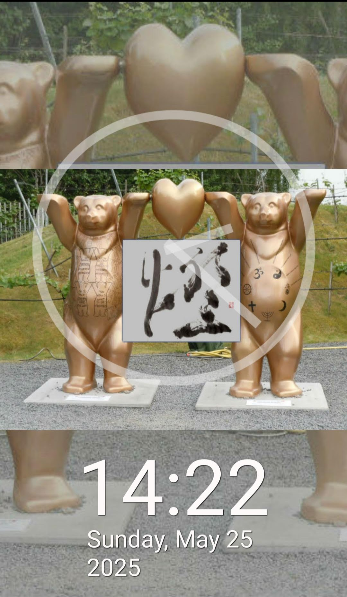

# Clock - Android App

## Overview
Clock is a simple Android application developed during vocational training.  
It features a digital clock display and was created to practice basic Android app development skills.

## Features
- Digital clock displaying the current time  
- (Optional) Alarm or timer functions  
- Simple and user-friendly interface

## Technologies Used
- Android Studio  
- Java
- XML for UI layout

## Screenshots
  

## What I Learned
- Basics of Android app development  
- Working with layouts and UI components  
- Implementing time-related functions on Android  
- Debugging and testing mobile applications

## Future Improvements
- Add alarm and timer functions  
- Improve UI design and usability  
- Implement notifications and background processing

## Notice
Some parts of this project’s code are based on sample code from a reference book.  
The copyright belongs to the author and publisher of that book.  
This repository is intended for educational and learning purposes only.  
Commercial use or redistribution is not permitted.
